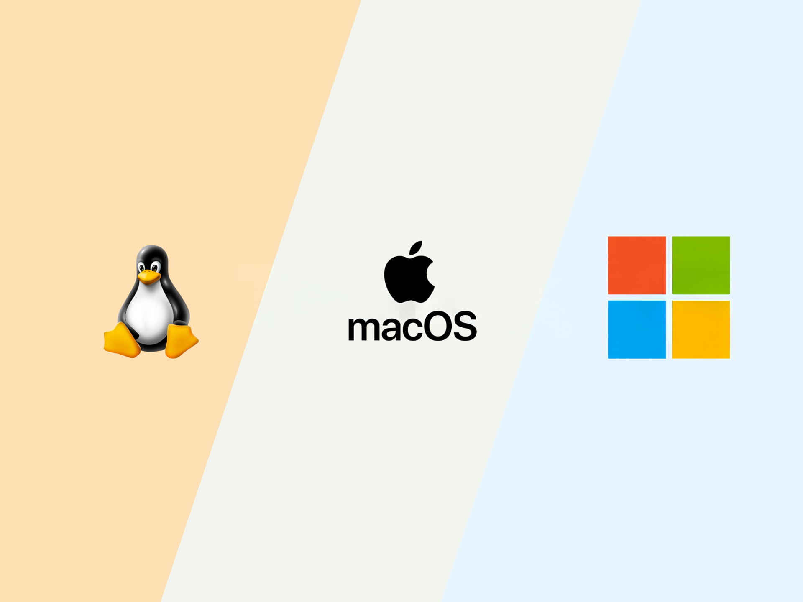

  

  

  
  
  

<table>
  <tr>
    <td width="62%" valign="top">
      <h2>🚀 About Me</h2>
      
👋 Hi! I'm <strong>Jesus Velasquez</strong>, a <strong>Systems Engineering student</strong> and a passionate <strong>Software Developer</strong>. I love creating projects, learning about <strong>web technologies</strong>, and exploring <strong>Artificial Intelligence</strong> to build innovative solutions that solve real-world problems.

      <h3>💡 What I do</h3>
      <ul>
        <li>💻 <strong>Skills in:</strong> C, C++, Java, Python, HTML, CSS, React</li>
        <li>🔍 <strong>Passionate about:</strong> Web Development and API Integration</li>
      </ul>
      <h3>🚀 What I'm looking for</h3>
      <ul>
        <li>💼 Exciting <strong>development opportunities and tech collaborations</strong></li>
        <li>📖 Learn <strong>new technologies</strong> and stay up to date with industry trends</li>
      </ul>
    </td>
    <td width="38%" align="right">
      
    </td>
  </tr>
</table>

 

<h2 align="center">Tech Stack</h2>

<table align="center">
  <tr>
    <td align="center" width="33%">
      <strong>Languages</strong> 
      
      
      
      
    </td>
    <td align="center" width="33%">
      <strong>Frontend</strong> 
      
      
      
      
      
    </td>
    <td align="center" width="33%">
      <strong>Backend</strong> 
      
    </td>
  </tr>
  <tr>
    <td align="center">
      <strong>Databases</strong> 
      
      
      
    </td>
    <td align="center">
      <strong>Runtime Environment</strong> 
      
    </td>
    <td align="center">
      <strong>Tools</strong> 
       
    </td>
  </tr>
</table>

  

---

<h2 align="center">⚙️ GitHub Analytics & Progress</h2>

  
  

  

  

---

  <ul align="center">
    
<h2 style="display: inline-block">Connect With Me</h2>

  </ul>

  
  
  

  

🤍 If you like my projects, please leave a ⭐ and share them!

Made with ❤️ by Jesus Velasquez

    

