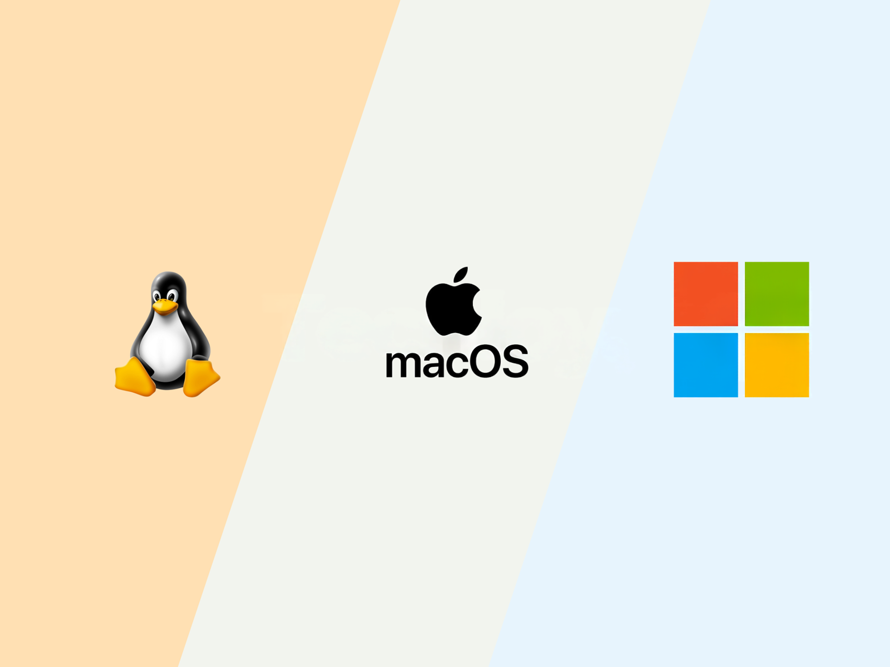

<table>
<tr>
<td width="62%" valign="top">

  <h2>🚀 About Me</h2>

  

    👋 Hi! I'm <strong>Jesus Velasquez</strong>, a <strong>Systems Engineering student</strong> from Colombia interested in <strong>software development</strong>, <strong>backend development</strong>, and <strong>full-stack technologies</strong>.
  

  

    💻 I enjoy building academic and personal projects, learning new technologies, and exploring <strong>Artificial Intelligence</strong> and <strong>Data Science</strong> to create practical solutions to real-world problems.
  

  <h3>💡 What I do</h3>

  <ul>
    <li>💻 <strong>Programming:</strong> Python, C++, JavaScript and Dart</li>
    <li>🌐 <strong>Web Development:</strong> HTML, CSS, JavaScript and React</li>
    <li>📱 <strong>Application Development:</strong> Flutter</li>
    <li>🔌 <strong>Backend & APIs:</strong> Python, Node.js, APIs and Supabase</li>
    <li>🗄️ <strong>Databases:</strong> SQL, PostgreSQL and MongoDB</li>
    <li>🤖 <strong>Artificial Intelligence:</strong> Exploring AI and Data Science</li>
  </ul>

  <h3>🚀 Currently Learning</h3>

  <ul>
    <li>🐍 <strong>Python:</strong> Backend development, software development and AI</li>
    <li>🌐 <strong>Web Development:</strong> React and JavaScript</li>
    <li>🔌 <strong>Backend:</strong> APIs, Node.js, Python and Supabase</li>
    <li>🗄️ <strong>Databases:</strong> SQL, PostgreSQL and MongoDB</li>
    <li>💻 <strong>Full Stack:</strong> Developing skills across frontend and backend technologies</li>
  </ul>

</td>

<td width="38%" align="right">
  
</td>
</tr>
</table>

 

<h2 align="center">Tech Stack</h2>

<table align="center">
<tr>

<td align="center" width="33%">
  <strong>Languages</strong> 
  
  
  
  
</td>

<td align="center" width="33%">
  <strong>Web Development</strong> 
  
  
  
  
</td>

<td align="center" width="33%">
  <strong>Backend</strong> 
  
  
  
</td>

</tr>

<tr>

<td align="center">
  <strong>Databases</strong> 
  
  
  
</td>

<td align="center">
  <strong>Tools</strong> 
  
  
  
</td>

<td align="center">
  <strong>Operating Systems</strong> 
  
  
  
</td>

</tr>
</table>

---

<h2 align="center">⚙️ GitHub Analytics & Progress</h2>

---

<ul align="center">

<h2 style="display: inline-block">Connect With Me</h2>

</ul>

🤍 If you like my projects, please leave a ⭐ and share them!

Made with ❤️ by Jesus Velasquez

